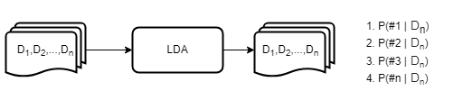

# lda_topic_modeling
#
Latent Dirichlet Allocation (LDA), is an unsupervised approach for identifying patterns and hidden or latent structures   
in unstructured objects such as text documents, labeling and interpreting the content based on the words contained in  
the material. The figure below provides a generic overview of the algorithm's application. Essentially, the application  
of the LDA model aims to identify latent topics by analyzing the most frequent words present in each topic and then  
grouping the documents based on the proportion of each topic they represent. (TAVANA, M.; SHAABANI, A.; JAVIER SANTOS- 
ARTEAGA, F.; RAEESI VANANI, I. A review of uncertain decision-making methods in energy management using text mining  
and data analytics. Informatik-Spektrum, v. 42, n. 6, p. 385–386, 2020)
#

#
## Note

This application was build based on a Scopus metadata storage on a CSV file.